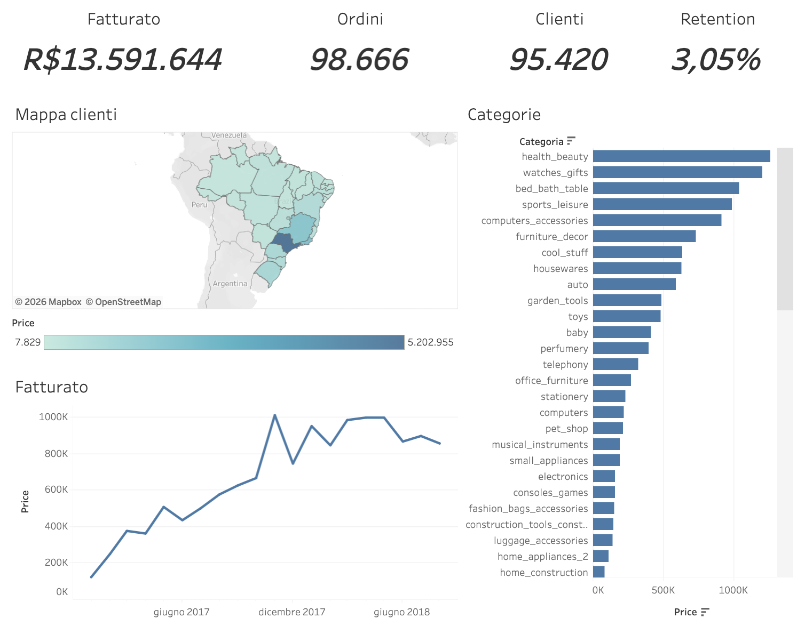

#  Olist — Analisi Vendite & Clienti

Progetto di analisi sul dataset pubblico [Olist Brazilian E-Commerce](https://www.kaggle.com/datasets/olistbr/brazilian-ecommerce): dai dati grezzi fino a una **dashboard interattiva** che risponde alle domande della direzione di un marketplace.

###  **[ Apri la dashboard interattiva su Tableau Public](https://public.tableau.com/app/profile/antonio.ferri4043/viz/Olist-AnalisiVenditeClienti/Dashboard1)**



---

## Il progetto in breve
**Olist** è un marketplace e-commerce brasiliano. La direzione vuole capire come sta andando il business.
Ho costruito l'**intera pipeline analitica**, dai dati grezzi alla dashboard,  per rispondere a: *quanto fatturiamo? Quali categorie e regioni rendono di più? I clienti tornano a comprare?*

##  Insight chiave
-  **Fatturato ~ R$ 13,6 mln**, in crescita costante nel 2017, con **picco a novembre 2017 (Black Friday)**.
-  Categorie top per fatturato: **health & beauty, orologi/regali, casa (bed & bath)**.
-  **Forte concentrazione geografica**: São Paulo da solo pesa **~38%** del fatturato → business dipendente dal Sud-Est, resto del Paese ancora inesplorato.
-  **Retention critica**: solo **~3% dei clienti** compra più di una volta → dipendenza dall'acquisizione continua di nuovi clienti.
-  **Le consegne in ritardo affossano la soddisfazione**: voto medio **4,29** (in orario) vs **2,57** (in ritardo) → la logistica è una leva strategica.

## Segmentazione clienti (RFM)

Ho classificato i ~95.000 clienti su **Recency, Frequency, Monetary** per capire
dove si concentra il valore.

**Nota metodologica.** Con retention ~3%, quasi tutti i clienti hanno un solo
ordine: la **Frequency è poco discriminante**. Ho quindi usato uno score di
frequenza a gradini (1 / 2 / 3+ ordini) e dato peso maggiore a **Recency e
Monetary** nella definizione dei segmenti.

| Segmento           | % clienti | % fatturato | Azione consigliata                          |
| ------------------ | --------- | ----------- | ------------------------------------------- |
| Campioni           | 15,5%     | 29,3%       | Trattenere: programmi VIP, fidelizzazione   |
| A rischio          | 14,7%     | 28,8%       | Riconquistare con offerte mirate            |
| Nel mezzo          | 34,9%     | 27,4%       | Spingere al secondo acquisto con promozioni |
| Fedeli (rari)      | 3,1%      | 5,6%        | Incentivare il riacquisto                   |
| Persi/Basso valore | 16,4%     | 4,6%        | Riattivazione a basso costo                 |
| Nuovi/Promettenti  | 15,4%     | 4,3%        | Incentivo al riacquisto                     |

**Insight chiave:**
- **Campioni + A rischio = 30% dei clienti ma ~58% del fatturato**: il valore è molto concentrato.
- Il segmento **"A rischio" vale ~29% del fatturato (~3,9 mln R$)** pur essendo solo il 14,7% dei clienti → massima priorità per il win-back.

## Raccomandazioni
Ogni criticità emersa dai dati si traduce in un'azione concreta:
- **Aumentare la retention.** Il business dipende dall'acquisizione continua, che è costosa. Suggerisco di testare campagne di **win-back post primo acquisto** (email a 30/60/90 giorni) sui segmenti RFM a rischio e di misurare l'impatto sul tasso di riacquisto a 6 mesi.
- **Trattare la logistica come leva strategica.** Il divario di soddisfazione tra consegne in orario (4,29) e in ritardo (2,57) impatta direttamente recensioni e riacquisto. Prioritizzare gli **stati/rotte con più ritardi** e stimare il ritorno
 di un miglioramento dei tempi sul rating medio.
- **Concentrazione su São Paulo (~38%).** Espansione mirata su Nordest/Centro-Ovest  partendo dalle categorie già forti, monitorando il costo di acquisizione per regione.

##  Stack tecnologico
| Strumento | Uso |
|-----------|-----|
| **Python** (pandas, NumPy) | esplorazione, pulizia, ETL |
| **PostgreSQL** + **SQLAlchemy** | database e caricamento dati |
| **SQL** | analisi (JOIN, CTE, window functions, RFM) |
| **Tableau Public** | dashboard interattiva |


##  Metodologia (pipeline)
1. **Data Understanding** — analisi delle 9 tabelle, qualità dei dati → [`notebook/01-Understanding.ipynb`](notebook/01-Understanding.ipynb)
2. **Modello dati** — diagramma / star schema → [`docs/data_model.png`](docs/data_model.png)
3. **ETL** — pulizia + caricamento in PostgreSQL → [`notebook/02-ETL.ipynb`](notebook/02-ETL.ipynb)
4. **Analisi SQL** — 5 domande di business come viste riusabili → [`sql/analisi.sql`](sql/analisi.sql)
5. **Segmentazione RFM** — clienti per valore (Recency, Frequency, Monetary) → [`sql/v_rfm_segmenti.sql`](sql/v_rfm_segmenti.sql)
6. **Visualizzazione** — dashboard interattiva in Tableau →  [`result/dashboard.png`](result/dashboard.png)

## 📁 Struttura del progetto
```
.
├── notebook/     # Jupyter: 01 data understanding, 02 ETL
├── sql/          # viste di analisi + segmentazione RFM
├── docs/         # diagramma del modello dati
├── result/       # export aggregati (KPI, categorie, trend, RFM) + dashboard
```


## 👤 Autore
**Antonio Ferri** — [Dashboard su Tableau Public](https://public.tableau.com/app/profile/antonio.ferri4043)
